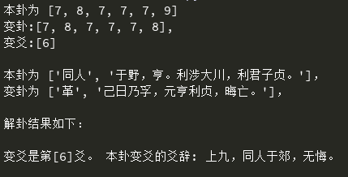

# 周易占卜 in Python

[](LICENSE)

**[Xiang Zhang](http://xiangzhang.info/)** (xiang.alan.zhang@gmail.com)

---

## 概述

传统的周易占卜需要五十或五十五根蓍草，且费时费力。三变为一爻，六爻为一卦，常常需要一个小时才能得出结果。本项目以Python程序模拟蓍草占卜过程，一秒钟即可得到本卦、变卦、变爻等卦象，极为简单便捷。更为重要的是，各个卦象出现的概率与用蓍草占卜的概率相同。总之，周易占卜的Python实现极大地提高了占卜的效率，却不影响结论的准确程度，实在是居家旅行的必备神器。

玩笑之谈，方家莫笑。

《易传》里有一篇《系辞》，虽然我不懂，但是可以抄过来作为理论依据：

> "大衍之数五十，其用四十有九。分而为二以象两，挂一以象三，揲之以四以象四时，归奇于扐以象闰。五岁再闰，故再扐而后挂。天一，地二；天三，地四；天五，地六；天七，地八；天九，地十。天数五，地数五。五位相得而各有合，天数二十有五，地数三十，凡天地之数五十有五，此所以成变化而行鬼神也。乾之策二百一十有六，坤之策百四十有四，凡三百六十，当期之日。二篇之策，万有一千五百二十，当万物之数也。是故四营而成《易》，十有八变而成卦，八卦而小成。引而伸之，触类而长之，天下之能事毕矣。显道神德行，是故可与酬酢，可与祐神矣。子曰：'知变化之道者，其知神之所为乎。'"

---

## 算卦

- 大衍之数五十，少一而生无穷变化。
- 开天地，定三才，除四象，归混沌，如是为一变。
- 三变成一爻，六爻为一卦。是为本卦。

## 变卦

- 爻分阴阳，可细分为老阴、少阳、少阴、老阳。
- 老阴生少阳，老阳生少阴。阴阳互变之爻为变爻。
- 爻变而卦变，是为变卦。

## 解卦

运行代码（`Zhan_Bu.py`）会生成一个 list 代表本卦。List 中的 6 个 elements 分别代表 6 爻（自下而上），其中 6、7、8、9 分别代表老阴、少阳、少阴、老阳。

如果有变爻，code 会同时输出一个变卦的 list 和一个代表变爻的 list。

解卦时需同时考虑本卦和变卦，共有七种情形：

1. 只有一个变爻，用本卦该变爻的爻辞判断吉凶。
2. 有两个变爻，用两个变爻的爻辞判断，以上方变爻为主。
3. 有三个变爻，用本卦和变卦的卦辞，以本卦为主。
4. 有四个变爻，用变卦的两个不变爻的爻辞，以下方不变爻为主。
5. 有五个变爻，用变卦的那一个不变爻的爻辞判断吉凶。
6. 有六个变爻：若为纯乾用"用九"，纯坤用"用六"；其余情形用变卦的卦辞。
7. 六爻均不变，用本卦的卦辞判断吉凶。

*算卦和变卦内容据文献[1]整理；解卦内容来自文献[2]。*

---

## 解卦示例



---

## Usage

```bash
python Zhan_Bu.py
```

---

## Requirements

Python >= 3.5. No external dependencies required.

---

## Repository Structure

```
├── Zhan_Bu.py          # Main divination script
├── 64gua_dic.py        # Dictionary of the 64 hexagrams
├── All_Gua_dic.pk      # Pickled hexagram data
└── Python解卦示例.png   # Example output screenshot
```

---

## References

1. 熊逸，《周易江湖》— 占卜：http://www.guoxue123.com/new/0001/zyjh/003.htm
2. 熊逸，《周易江湖》— 变卦：http://www.guoxue123.com/new/0001/zyjh/004.htm
3. 解卦（卦辞、爻辞）：https://www.guoyi360.com/yj/

---

## Contact

[xiang.alan.zhang@gmail.com](mailto:xiang.alan.zhang@gmail.com)

## License

This project is licensed under [CC BY-NC-SA 4.0](LICENSE). Commercial use is prohibited.
